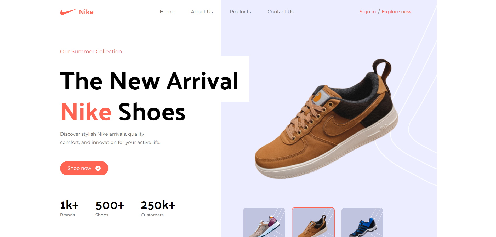
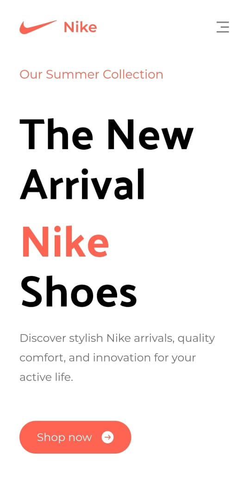
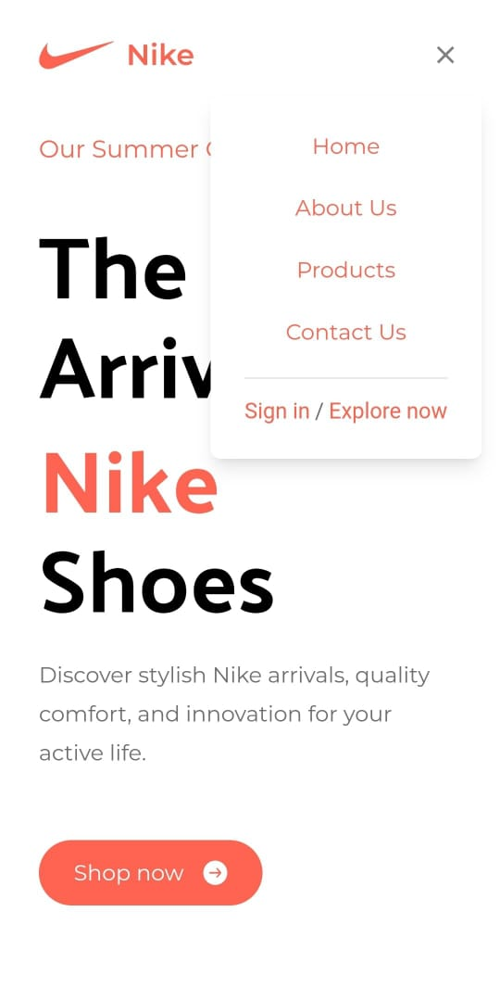

# NIKE

## Description

This project is a React-based web application that provides a comprehensive and interactive user interface. The application is structured into several sections, each serving a unique purpose. Each section is carefully styled using Tailwind CSS, a utility-first CSS framework that allows for highly customizable designs. The application is responsive, ensuring a great user experience on both desktop and mobile devices.

## Website Link

You can access the live website here 👉 [Nike](https://ranjan-nike.netlify.app/)

## Screenshots

### Desktop View



### Mobile View




## Tech Stack

- React
- Tailwind

## How to quickly run this on your device

You can follow these steps to set up the project locally on your machine.

**Prerequisites**

Make sure you have the following installed on your machine:

- [Git](https://git-scm.com/)
- [Node.js](https://nodejs.org/en)
- [npm](https://www.npmjs.com/) (Node Package Manager)

**Cloning the Repository**

```bash
git clone https://github.com/Shubhankar-Ranjan/Nike.git
cd Nike
```

**Installation**

Install the project dependencies using npm:

```bash
npm install
```


**Running the Project**

```bash
npm start
```

## How to Contribute

I appreciate and welcome contributions to improve this website. If you would like to contribute, please follow these steps:

1. Fork the repository.
2. Create a new branch: `git checkout -b feature/your-feature-name`.
3. Make your changes and commit them: `git commit -m "Add your message here"`.
4. Push the changes to your fork: `git push origin feature/your-feature-name`.
5. Create a pull request to this repository's `main` branch.

I will review your pull request, and if everything looks good, I will merge it into the main branch. Thank you for helping make this website even better!

## Support

If you encounter any issues with the website or have any questions, please feel free to reach out to me at my LinkedIn 👉 [Shubhankar Ranjan](https://www.linkedin.com/in/shubhankar-ranjan/).

I value your feedback and will do my best to assist you with any concerns or queries you may have.
